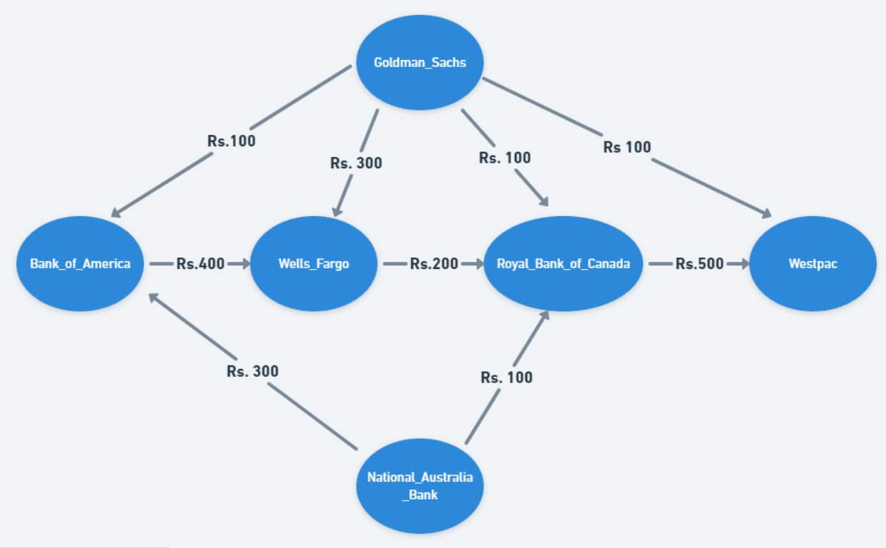
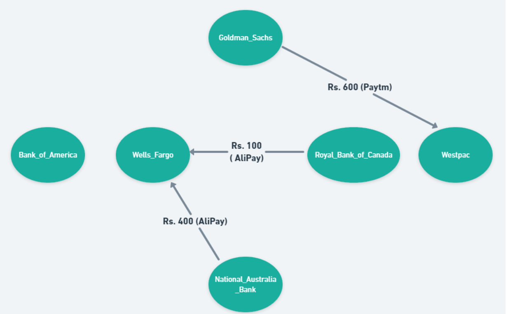
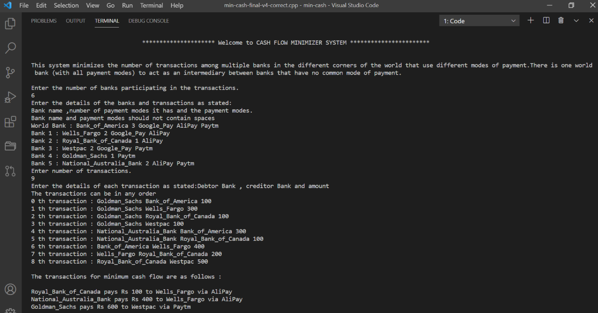

## **PayFlux**
### Cash-Flow-Minimizer

This system minimizes the number of transactions among multiple banks in the different corners of the world that use different modes of payment. There is one world bank (with all payment modes) to act as an intermediary between banks that have no common mode of payment.

### **Introduction**
Let's take an example. say we have the following banks:

Bank_of_America (World bank)
Wells_Fargo
Royal_Bank_of_Canada
Westpac
National_Australia_Bank
Goldman_Sachs
Following are the payments to be done:
    **Debtor Bank**         **Creditor Bank**         **Amount**

Goldman_Sachs        Bank_of_America           Rs 100
Goldman_Sachs        Wells_Fargo           Rs 300
Goldman_Sachs        Royal_Bank_of_Canada       Rs 100
Goldman_Sachs        Westpac              Rs 100
National_Australia_Bank      Bank_of_America           Rs 300
National_Australia_Bank      Royal_Bank_of_Canada          Rs 100
Bank_of_America          Wells_Fargo             Rs 400
Wells_Fargo            Royal_Bank_of_Canada       Rs 200
Royal_Bank_of_Canada        Westpac              Rs 500

Each Bank only supports a set of modes of payments and can make or receive payments only via those. Only World Bank suppports all modes of payments. In our example we have only three payment modes :

- Google_Pay
- AliPay
- Paytm

Following is the list of Banks and their supported payment modes :

- Bank_of_America       -   Google_Pay, AliPay, Paytm
- Wells_Fargo          -   Google_Pay, AliPay
- Royal_Bank_of_Canada      -   AliPay
- Westpac             -   Google_Pay, Paytm
- Goldman_Sachs       -   Paytm
- National_Australia_Bank       -   AliPay, Paytm

To pick the first Bank, we calculate the net amount for every Bank by using the below formula and store them in list:

net amount = [Sum of all credits(amounts to be received)] - [Sum of all debits(amounts to pay)]

Now the idea is that we are finding the bank which has minimum net amount(max debtor) (say Bank X, net amount x) and then finding the bank which has the maximum net amount( max creditor) (say Bank Y, net amount y) and also has a common payment mode (say M1) with the former bank. Then we find minimum of absolute value of x and y, lets call it z.
Now X pays the amount z to Y. Then 3 cases may arrived:

- If (magnitude of x) < y => X is completely settled and so removed from the list.
- If (magnitude of x) > y => Y is completely settled and so removed from the list.
- If (magnitude of x) = y => X and Y both are completely settled and so both are removed from the list.
The same process is repeated for the remaining banks.
For the current example, the transactions for minimum cash flow are as follows:

### How To Use
This system is completely Terminal driven. So when you will run the C++ Application, it will guide you and show you the final output.
Below is the execution of our current example:

**Thank you**
*Made with ❤️ by Anirudha Chaudhary*